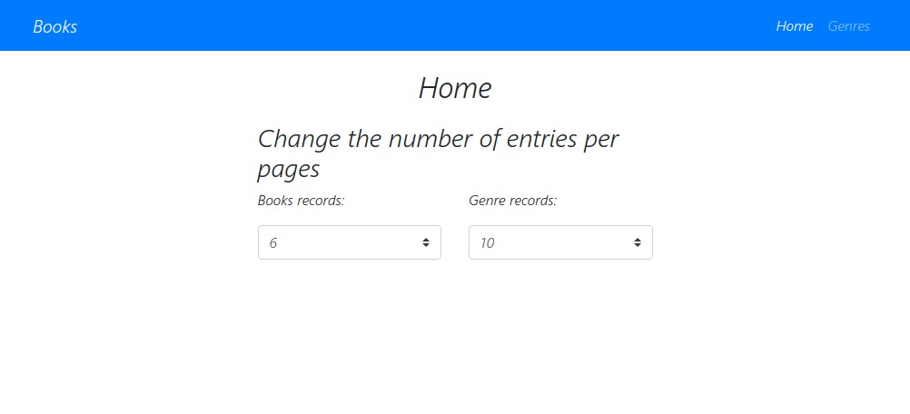
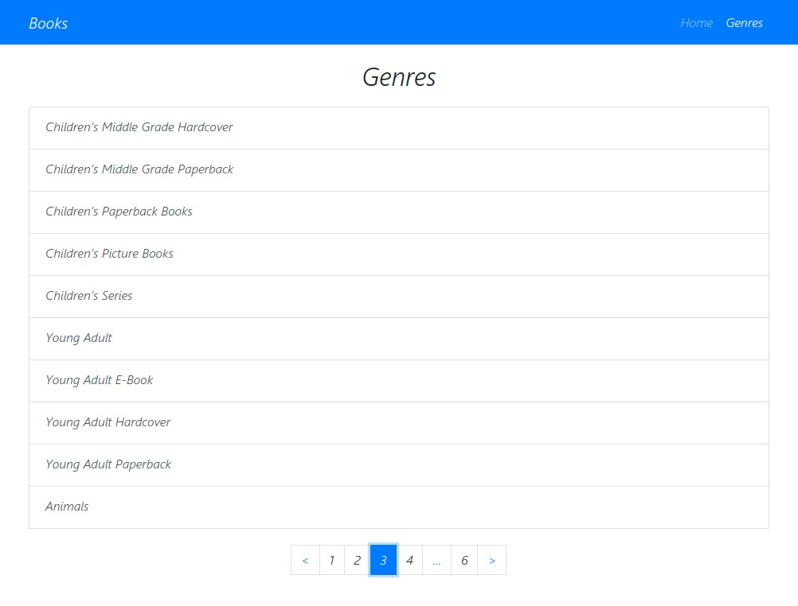
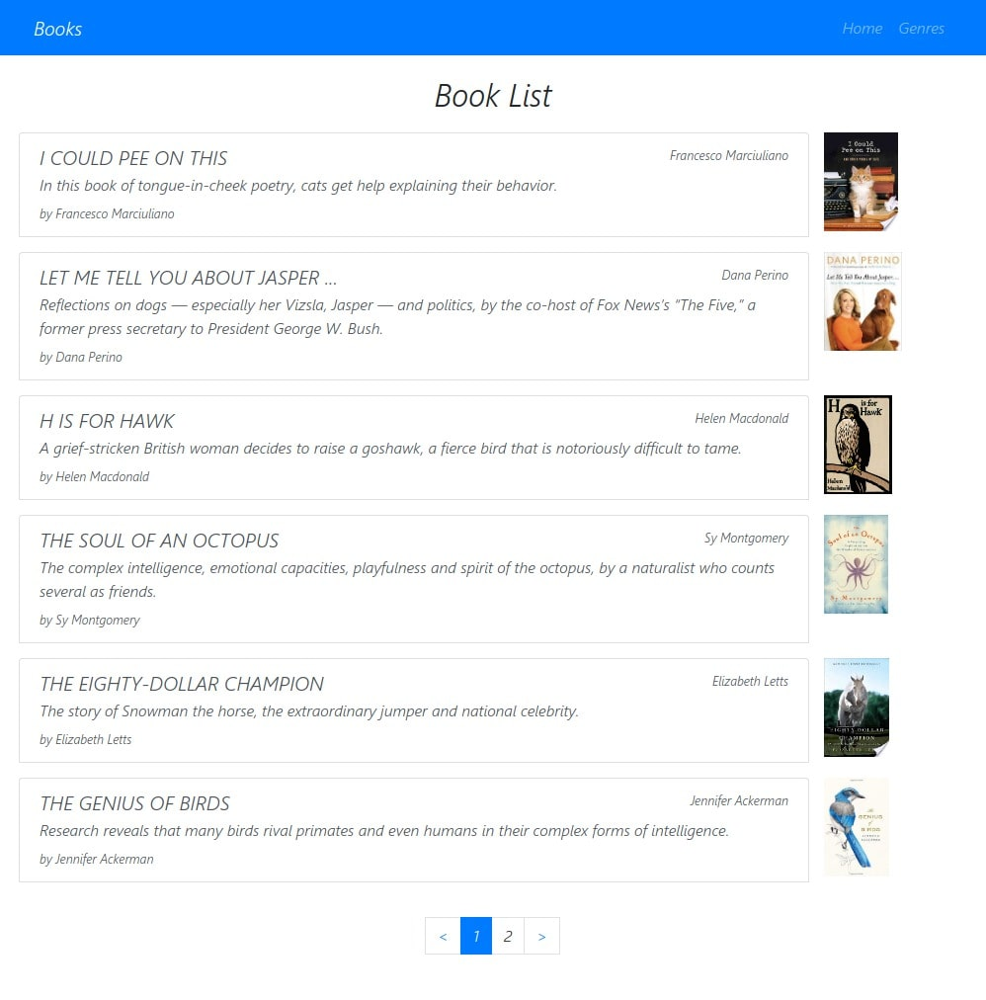
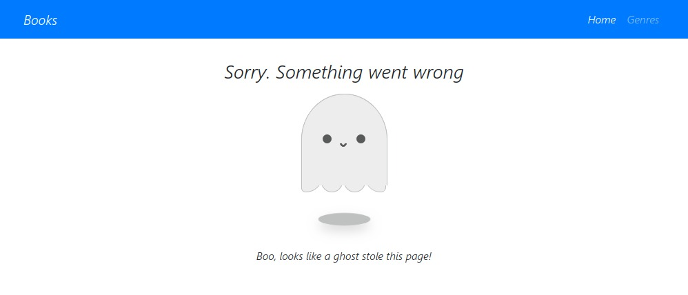

## React Books TS

In the project I used React technology as a useContext and useReducer. The project implemented bug capture and animation of data downloads.

The homepage works like an admin panel to set up a display of the number of entries on the page

For security reasons, the project settings are in the <strong>.env.local.example</strong> file which needs to be renamed <strong>.env.local</strong> and enter the correct key that you can get by registering on the site [api.nytimes.com](https://developer.nytimes.com/get-started)

This project was bootstrapped with [Create React App](https://github.com/facebook/create-react-app).

The data I get is asynchronously from the [api.nytimes.com](https://developer.nytimes.com/get-started)

It was also used as an add-on packages [react-router-dom](https://github.com/ReactTraining/react-router/tree/master/packages/react-router-dom) and [react-paginate](https://github.com/AdeleD/react-paginate)

You can watch the data download animation here [loader-animation-example](https://codepen.io/FilipVitas/pen/QoVpom)

